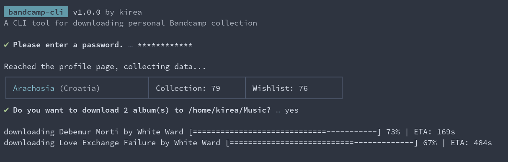

# bandcamp-cli

This is a simple node cli tool for downloading and extracting files from your personal Bandcamp collection.
It uses [puppeteer](https://github.com/puppeteer/puppeteer/) to login and scrape data and then uses [request](https://github.com/request/request) to download albums in the specified file format and lastly, [adm-zip](https://github.com/cthackers/adm-zip) to extract the files to a directory of your choosing (default is _Music_).

The way it writes files to a directory is by following this hierarchy:

- Band/Artist's name
  - Album Title
    - Tracks

The project is new so there is a likelihood of encountering issues.

## Installation

In order to use this cli you need to have node and npm installed beforehand.

```sh
git clone https://github.com/hisekai/bandcamp-cli.git
cd bandcamp-cli
npm install
```

And that's it. You can run the project from the project directory with node. **You will be prompted to enter your password from the command-line.**

```sh
node index.js -u <username> // this downloads the entire collection
```

In order to make using the cli easier you can also link it in the root directory (`npm link`) so that you can use it globally, then you can use `bandcamp-cli` anywhere from the terminal instead of having to navigate to the project folder every time.

## List of options

There are options for specifying the audio file format (_mp3, mp3_320, flac, aac, ogg, alac, wav, aiff_), the directory to which to extract the files to, downloading only from a single artist, or only downloading a single title, as well as downloading only the last number of albums from your collection. You can also run `bandcamp-cli help` to list all the flags.

| flags         | alias |                                                                           |
| ------------- | :---: | ------------------------------------------------------------------------- |
| --username    |  -u   | your bandcamp username (required)                                         |
| --destination |  -d   | directory where the files are extracted to (default: Music)               |
| --format      |  -f   | audio file format to download (default: flac)                             |
| --last        |  -l   | download only the last number of albums                                   |
| --artist      |  -a   | downloads albums by this exact artist (case insensitive, can be multiple) |
| --artists     |  -A   | downloads albums by bands with the artist's name (case insensitive)       |
| --title       |  -t   | downloads albums by this exact title (case sensitive, can be multiple)    |
| --titles      |  -T   | downloads any album that contains the provided value (case insensitive)   |
| --rename      |  -r   | renames the band/artist's name                                            |

### A few examples

Downloads the entire collection

```sh
bandcamp-cli -u <username>
```

Downloads the last 2 albums from the collection

```sh
bandcamp-cli -u <username> -l 2
```

Downloads all the albums by the band My Fav Artist

```sh
bandcamp-cli -u <username> -a "My Fav Artist"
```

Downloads all the albums by the bands "My Fav Artist" and "A new band"

```sh
bandcamp-cli -u <username> -a "My Fav Artist" -a "A new band"
```

Downloads the album titled "Cool Album" in mp3 format

```sh
bandcamp-cli -u <username> -t "Cool Album" -f mp3
```

Downloads any album that contains "cool" in its title and extracts it to MyFolder

```sh
bandcamp-cli -u <username> -T "cool" -d MyFolder
```

Downloads all the albums that have "some band" included as the artist. This is in particular helpful when there are album splits with multiple artists.

```sh
bandcamp-cli -u <username> -A "some band"
```

Downloads all the albums by "some band" and makes sure the artist's folder is called "Some Band". This is useful when bands/artists publish their work on different pages and under different publishers with variations in spelling (uppercase, lowercase, capital letters etc.) to prevent having different folders of the same artist/band. Note that this should be used in conjuction with other flags like -a or -t.

```sh
bandcamp-cli -u <username> -a "some band" -r "Some Band"
```

## Issues

It is common for the site to use captcha as an anti-bot measure. Unfortunately, I haven't found a (free) workaround for it. Not using puppeteer in headless mode helps but is not 100% guaranteed to work which is why the headless mode is now set to false.
